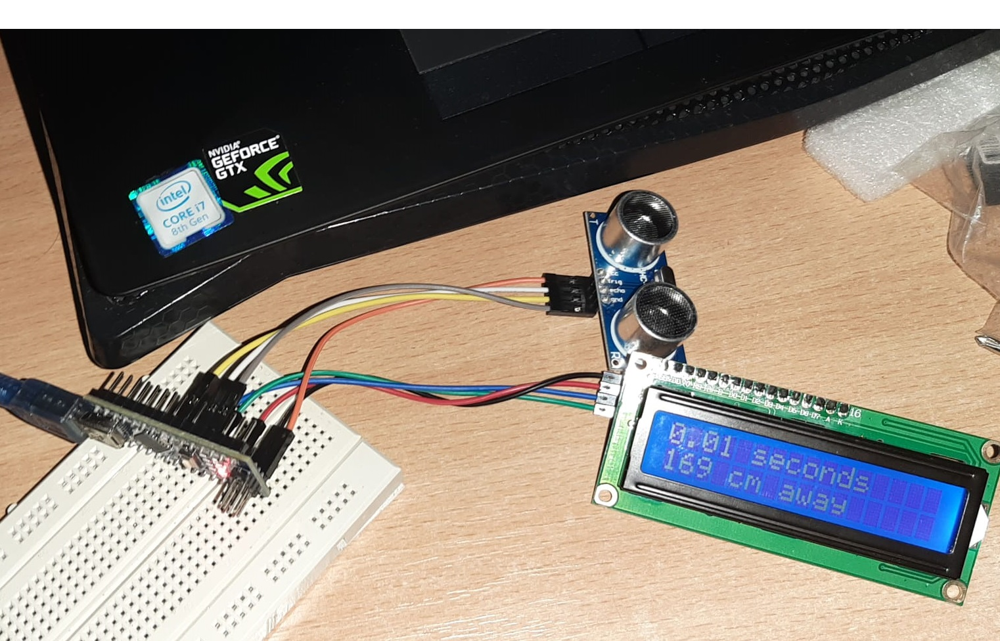
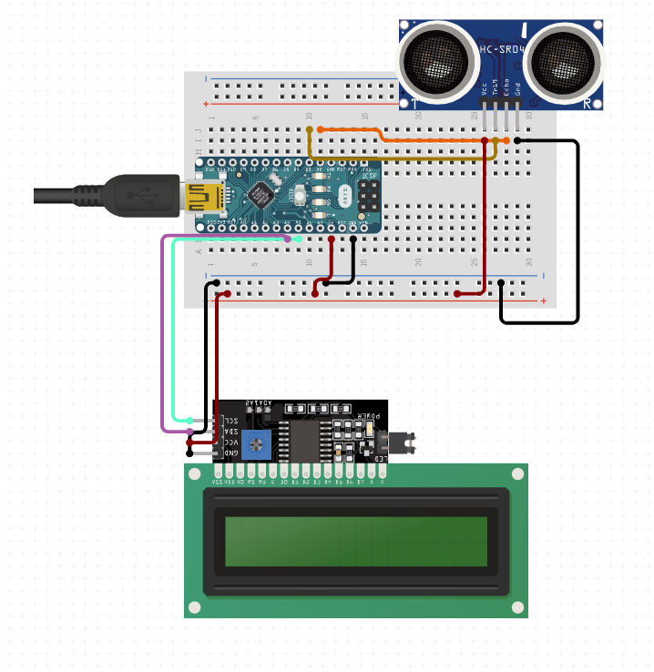
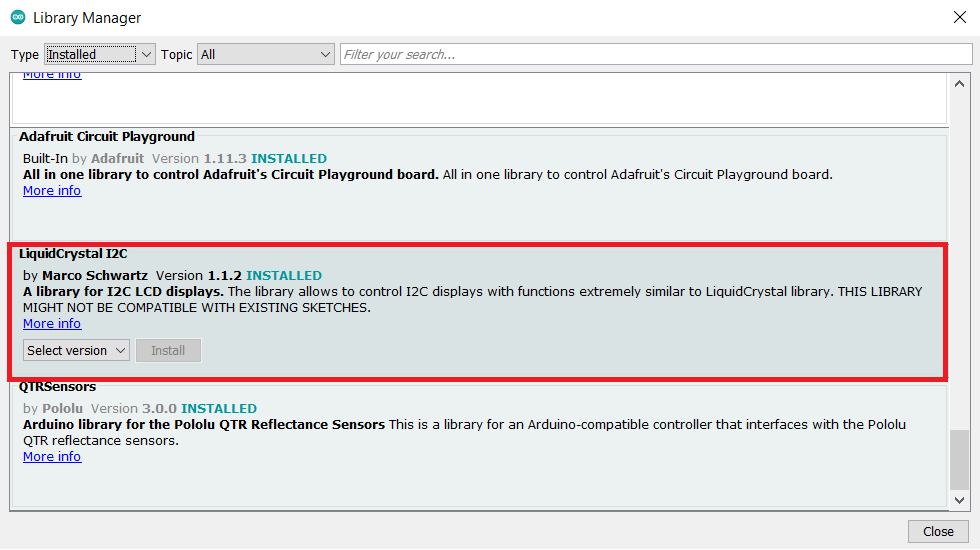

# Arduino distance sensor

This example shows us how we can easily make a distance sensor with display using Arduino Nano. The components used in this project are listed in a section below, with a link for each one of them. We are using a distance sensor in order to detect our obstacle, so the sensor creates an ultrasonic pulse which it then intercepts and with a little bit of physics we can detect how far the obstacle is.  
We assume that the speed of sound is 343 m/s and we know that the sound goes back and forth, so me must divide our distance by two. Also, we assume that the distance is equal to the duration times the velocity/speed of sound (distance = time * speed of sound). Our input data is received in microseconds (μs), so we must convert the input, and also the output which is going to be in meters by converting it to centimeters (cm).  
Finally, our distance is d = input /(1'000'000 μs) * (343 m/s) * (100 cm) / 2, which is roughly input * 0.01715 cm. We then display on our LCD screen, which is using the I2C communication protocol, the time it takes for the sound to return to our sensor (in seconds) on the first row, and on the second row the distance to the obstacle (in  centimeters), computed using our formula.  
We are perfroming this operation once per second.  
More details can be found in the code ( read the comments).

> **Note:** Due to lack of jumper wires, the VIN pin has been use for VCC when connecting the distance sensor instead of 5V.
> For the schematics the following page has been used: 
> [Schematics page](https://www.circuito.io/app).
> The links for the hardware components have specifications and instructions for each one of them.

## Schematics

## Pre-requisites

### HARDWARE:
     - [Arduino nano (V3 ATmega328p)](https://ardushop.ro/ro/electronica/31-placa-de-dezvoltare-nano-v3-atmega328.html)
     - [LCD 1602 screen (02 => 2 lines, 16 => 16 characters per row) + I2C adapter](https://ardushop.ro/ro/home/1893-lcd-1602-verde-iic.html?search_query=lcd&results=54)
     - [Ultrasonic sensor module (HC-SR04)](https://ardushop.ro/ro/home/47-modul-senzor-ultrasonic-detector-distanta.html?search_query=distanta&results=80)
     - 8 jumper wires
     - Mini USB cable in order to load the code and power arduino nano

SOFTWARE :

     - [I2C LCD library](https://github.com/johnrickman/LiquidCrystal_I2C)

TECHNICAL INFORMATION:

     - [Distance sensor](https://linuxhint.com/hc-sr04-ultrasonic-sensor-arduino-nano/)
     - [I2C display](https://www.youtube.com/watch?v=wKuTvRgGuVU)

## Setup and Build

To setup, follow these steps below.

1.  Connect the distance sensor to the Arduino board 
> GND to GND  
> TRIG to D2  
> ECHO to D4  
> VCC to VIN  

2.  Connect the I2C adapter of the LCD display to the Arduino board
> GND to GND  
> VCC to 5V  
> SDA to A4  
> SCL to A5  

3.  Include the I2C LCD library from the Arduino IDE

4. In the Arduino IDE select the port (it does so automatically), the Board - Arduino Nano and the bootloader ATmega328P (Old Bootloader) from the Tools section

## Running

To run the app you just have to upload it using the button in the top left corner of the Arduino IDE `Upload`, which is right next to `Verify`. You should be all set. In case of any LCD display issues, press the button of the Arduino board which will reload the programme.

## Tutorial

